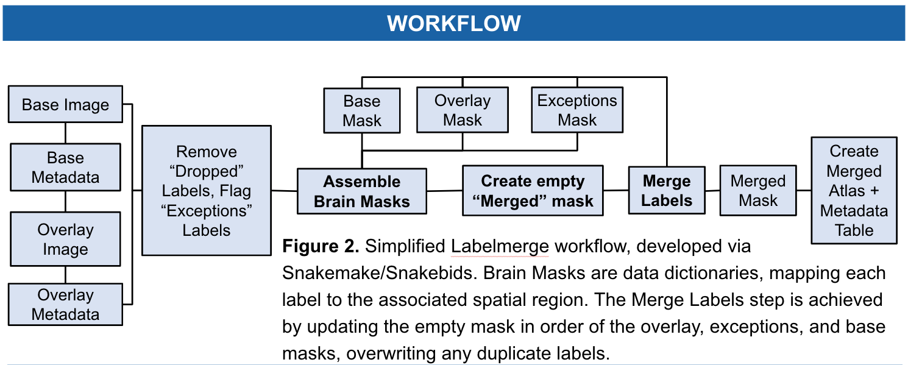
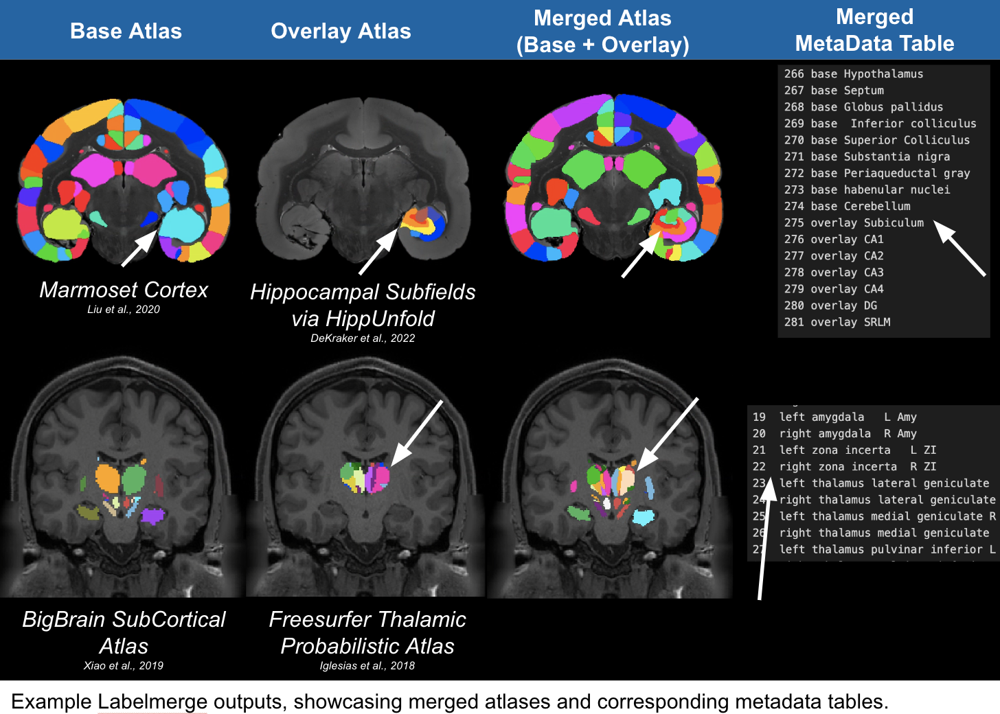

# Workflow Details

This section describes the Labelmerge workflow (i.e. steps taken to produce 
intermediate and final files). Labelmerge is a 
[Snakemake](https://snakemake.readthedocs.io/en/stable/) workflow, and thus a 
directed acyclic graph (DAG) that is automatically configured based on a set of 
rules. A simplified workflow schematic is also shown below.

## Overall workflow
[Labelmerge](https://github.com/khanlab/labelmerge) allows users to combine
segmentations from varying sources. For example, previously segmented
thalamic nuclei to be combined with an atlas of other subcortical structures. 

_(Click on an image to enlarge)_

Snakemake workflows are organized into groups of rules, each
representing the different phases of the workflow. Each grouped set of rules 
also exist in separate rule files, which can be found under the 
[rules sub-directories](https://github.com/khanlab/labelmerge/tree/main/labelmerge/workflow/rules) 
in the workflow source. 

At a more granular level, Labelmerge reads one “base” and one “overlay” atlas image organized as [BIDS 
derivatives](https://bids-specification.readthedocs.io/en/stable/01-introduction.html),
with the label names supplied as metadata in separate TSV files. Brain masks are data dictionaries, 
mapping each atlas label to the associated spatial region.  The merge labels step is achieved by updating an empty "merged" mask 
in order of the base and overlay atlases, overwritting any duplicate labels.  Users also have additional flexibility to tag specific 
labels to be dropped or included as exceptions within the created merged mask. Finally, a new image is written alongside a metadata table 
where the label names are prepended with “base “ or “overlay “ as appropriate. 
